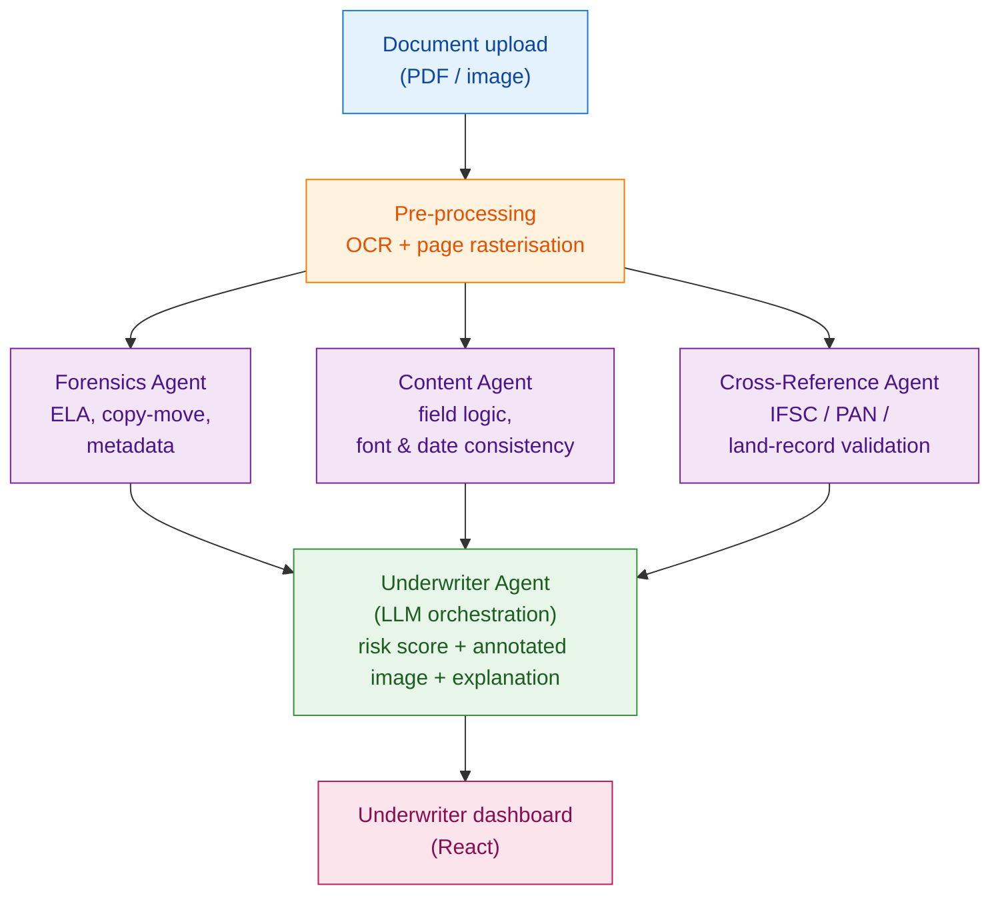

# SuRaksha_Cyber_Hackathon_2.0_Architecture

Architecture diagram for SuRaksha Cyber Hackathon 2.0

# TrustLens

**Agentic Document Verification for Loan Underwriting**

TrustLens detects tampering, forgery, and inconsistency across documents submitted during loan underwriting — salary slips, bank statements, land records, and legal documents — in real time. Instead of a raw "fraud / not fraud" flag, it returns an underwriter-friendly risk report: a confidence score, the document image with suspicious regions highlighted, and a plain-English explanation with an Approve / Review / Reject recommendation.

> Built for the SuRaksha Cyber Hackathon 2.0 — Theme: Real-time Anomaly Detection.

---

## Architecture

### How it works

The system is a small crew of specialised agents, each inspecting the document the way a different human expert would. The design principle is **defence in depth** — a forged document has to survive three independent checks, so fixing one giveaway is not enough to defeat it.

1. **Forensics Agent** — Inspects the document as an image: Error Level Analysis (ELA), copy-move detection, noise/compression analysis, and metadata (EXIF, software tags, mismatched creation/modification dates).
2. **Content Agent** — OCRs the document, extracts structured fields, and runs consistency logic: font variation within a line, coherent dates, and whether declared salary reconciles with bank-statement deposits.
3. **Cross-Reference Agent** — Validates extracted data against external/mock sources: IFSC validity, PAN format, and a stubbed land-records lookup.
4. **Underwriter Agent** — Synthesises every signal into a risk score (0–100), an annotated image, and a plain-English explanation with a recommendation.

---

## Tech Stack

| Layer         | Technology                                                        |
| ------------- | ----------------------------------------------------------------- |
| Frontend      | React (upload view, annotated-document viewer, risk report panel) |
| Backend       | Python (FastAPI) orchestrating the agents                         |
| Forensics     | OpenCV (ELA, copy-move), Pillow (metadata)                        |
| OCR           | Tesseract / PaddleOCR                                             |
| Orchestration | LLM for synthesising signals into the underwriter report          |

---

## Demo Flow

1. Upload a **clean** salary slip → low risk (green).
2. Upload the **same document, doctored** → lights up red, highlights the tampered region, and explains why in plain English.
